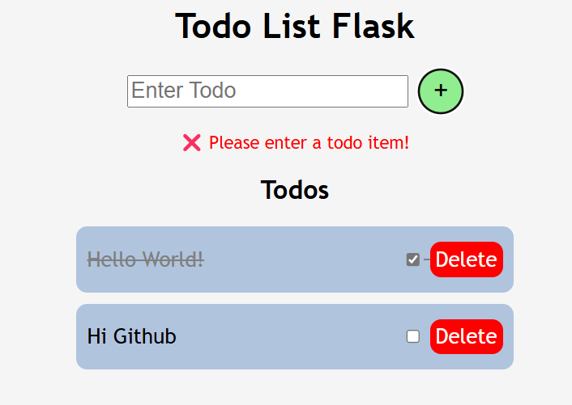

 # TODO List App 📝 - Flask

 

Hello everyone! 👋 This is a simple yet efficient Todo List Web Application built using Flask, HTML, CSS, and JavaScript. The app provides a clean and intuitive interface for managing daily tasks with ease.

 
 
# Features ✨:
✅ Add Tasks – Users can add new tasks to their list.
✅ Mark as Completed – Completed tasks are visually indicated with a line-through effect.
✅ Delete Tasks – Easily remove tasks when they are no longer needed.
✅ Form Validation – Prevents empty task submission with a user-friendly error message.

# Technologies 🛠️:
* Flask (Python Backend)
* HTML, CSS, JavaScript (Frontend)

